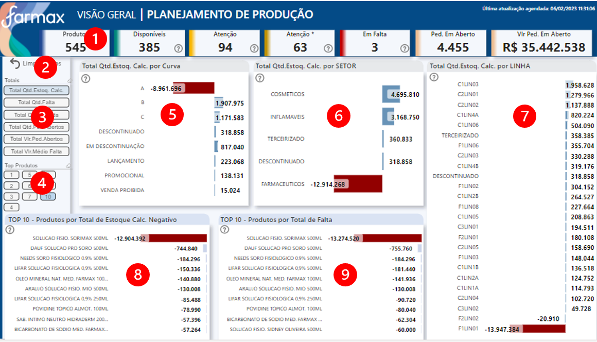
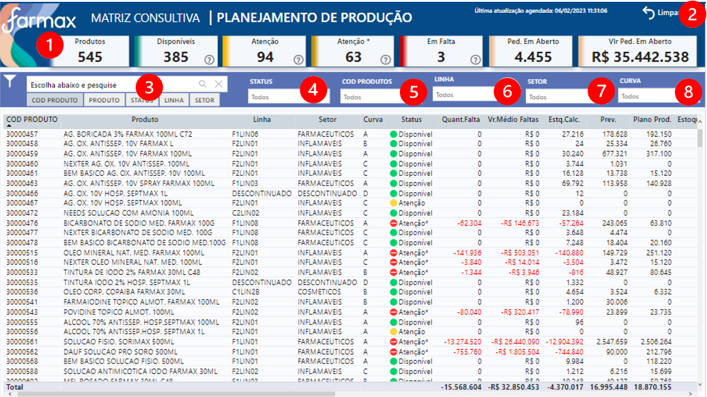

# **Seja bem vindo (a)**

**Documentação dos dashboards do setor de Planehamento, clique abaixo e navegue para o App no Power BI Service:**

<a href="https://app.powerbi.com/Redirect?action=OpenApp&appId=61116a2c-d69d-4d6e-b1ef-70adb59291eb&ctid=4019cfa9-aae5-4964-912e-b0e0bb606d37" target="_blank">
**Aplicativo Planejamento**
</a>

---

## **OBJETIVO - PLANEJAMENTO DE PRODUÇÃO**
Analisar faltas, estoque e vendas.
---

## **FONTE DE DADOS**

~~~
let
    Fonte = AmazonRedshift.Database("farmax-cluster.cdkgzqhbae0k.us-east-1.redshift.amazonaws.com","farmaxcluster"),
    com = Fonte{[Name="com"]}[Data],
    plan_prod = com{[Name="plan_prod"]}[Data]
~~~

---
## **TABELAS**

1. Planejamento de produção

2. Medidas

3. Parâmetro - Totais	 

4. Parâmetro Categoria	

5. Parâmetro - TOPN		

6. Última Atualização	
	

---
## **ATUALIZAÇÃO CONJUNTO DE DADOS**
Atualização diária do conjunto de dados, às 06:30 / 08:30 / 10:30 / 12:30 / 14:30 / 16:30 / 18:30.

---
## **ACESSO**
Acesso via aplicativo Power BI, da seguinte forma:

<a href="https://app.powerbi.com/home" target="_blank">

1. Acessar **powerbi.com.br** </a>

2. Ir no painel de Navegação, opção "Aplicativos" ou "Aplicações"

3. Clicar no Aplicativo - Imagem abaixo>

---

### **VISÃO GERAL - PLANEJAMENTO DE PRODUÇÃO**

**Glossário:**

1. Cards resumo numérico
2. Botão para limpar filtros
3. Filtro: **Totais** -  Total: Estoque Calculado / Faltas / Quantidade Vendida / Pedidos em Aberto / Valor Pedidos em Aberto / Valor Médio de Faltas.- *Utilize para filtrar visuais ***5, 6 e 7** 
4. Filtro: **Top 10**   -  *Utilize para filtrar visuais ***8 e 9**.  
5. Visual: **Eixo Dinâmico: Totais por Curva**
6. Visual: **Eixo Dinâmico: Totais por Setor**
7. Visual: **Eixo Dinâmico: Totais por Linha**
8. Visual: **Top Produtos por Total de Estoque Calculado Negativo**
9. Visual: **Top Produtos por Total de Falta**
---

### **MATRIZ CONSULTIVA - PLANEJAMENTO DE PRODUÇÃO**

**Glossário:**

1. Cards resumo numérico
2. Botão para limpar filtros
3. Filtro de Texto por **Descrição, Código, Status, Linha ou Setor do produto**
4. Filtro por **Status**
5. Filtro por **Código do Produto**
6. Filtro por **Linha**
7. Filtro de Texto por **Setor**
8. Filtro Cliente por **Cruva**
---

## **DOCUMENTAÇÃO POWER BI**  - (clique abaixo para visualizar) 

[**Documentação**](AD_Planejamento/DOC_PBI_PLANEJAMENTO_PROD.htm)

[**Regras do Negócio**](AD_Planejamento/REGRAS_PLANEJAMENTO_DE_PRODUCAO.pdf)

## **CANVAS**  - (clique abaixo para visualizar) 

[**Canvas**](AD_Planejamento/CANVAS_PLANEJAMENTO_DE_PRODUCAO.pdf)

---

## **MANUAL DO USUÁRIO**  - (clique abaixo para visualizar) 

[**Manual do Usuário**](AD_Planejamento/MANUAL_USUARIO.pdf)

