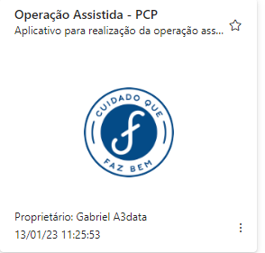

# **Seja bem vindo (a)**
### Documentação dos dashboards do setor de Marketing, clique abaixo e navegue para o App no Power BI Service

- [Lançamentos](https://app.powerbi.com/Redirect?action=OpenApp&appId=f194a00f-199a-47b8-bce1-59bcb5635cac&ctid=4019cfa9-aae5-4964-912e-b0e0bb606d37)

---

### OBJETIVO
Acompanhamento do ciclo de lançamento do produto. 

### FONTE DE DADOS

~~~
Fonte = AmazonRedshift.Database("farmax-cluster.cdkgzqhbae0k.us-east-1.redshift.amazonaws.com","farmaxcluster"),com = Fonte{[Name="com"]}[Data],
mkt_report1 = com{[Name="mkt_report"]}[Data]
~~~
### TABELAS

1. Mkt_report

2. Medidas

3. Última atualizaçao 

### ATUALIZAÇÃO CONJUNTO DE DADOS
Atualização diária do conjunto de dados, às 06:30.

### ACESSO
Acesso via aplicativo Power BI, da seguinte forma:

1. Acessar powerbi.com.br

2. Ir no painel de Navegação, opção "Aplicativos" ou "Aplicações"

3. Clicar no Aplicativo - Imagem abaixo>

