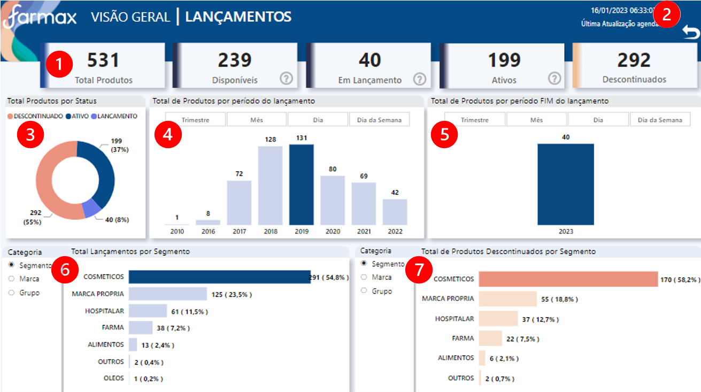

# **Seja bem vindo (a)**

**Documentação dos dashboards do setor de Marketing, clique abaixo e navegue para o App no Power BI Service**

<a href="https://app.powerbi.com/Redirect?action=OpenApp&appId=f194a00f-199a-47b8-bce1-59bcb5635cac&ctid=4019cfa9-aae5-4964-912e-b0e0bb606d37" target="_blank">
**Lançamentos**
</a>

---

## **OBJETIVO**
Acompanhamento do ciclo de lançamento de produtos. 

## **FONTE DE DADOS**

~~~
Fonte = AmazonRedshift.Database("farmax-cluster.cdkgzqhbae0k.us-east-1.redshift.amazonaws.com","farmaxcluster"),com = Fonte{[Name="com"]}[Data],mkt_report1 = com{[Name="mkt_report"]}[Data]
~~~

---
## **TABELAS**

1. Mkt_report

2. Medidas

3. Última atualizaçao 

---
## **ATUALIZAÇÃO CONJUNTO DE DADOS**
Atualização diária do conjunto de dados, às 06:30.

---
## **ACESSO**
Acesso via aplicativo Power BI, da seguinte forma:

<a href="https://app.powerbi.com/home" target="_blank">

1. Acessar **powerbi.com.br** </a>

2. Ir no painel de Navegação, opção "Aplicativos" ou "Aplicações"

3. Clicar no Aplicativo - Imagem abaixo>

 

---
## **USABILIDADE**

**PÁGINA - 1**

### **VISÃO GERAL LANÇAMENTOS**

**Glossário:**

1. Cards resumo numérico
2. Botão para limpar filtros
3. Visual: **Total de Produtos por Status** 
4. Visual: **Total de Produtos por período de lançamento**   - Todos os produtos por data de lançamento 
5. Visual: **Total de Produtos por período Fim do lançamento**   - Todos os produtos por data Fim de lançamento 
6. Visual: **Total de Lançamento por Segmento/Marca/Grupo**  - Utilize o filtro de visual "Categoria"
7. Visual: **Total de Produtos Descontinuados por Segmento/Marca/Grupo**  - Utilize o filtro de visual "Categoria"
---
**PÁGINA - 2**

### **MATRIZ CONSULTIVA - LANÇAMENTOS**

**Glossário:**

1. Cards resumo numérico
2. Botão para limpar filtros
3. Filtro por **Texto**
4. Filtro por **Cód. Do Produto**
5. Filtro por **Status**
6. Filtro por **Marca**
7. Filtro por **Grupo**
7. Filtro por **Segmento**
---

## **DOCUMENTAÇÃO POWER BI**  - (clique abaixo para visualizar) 

[**Documentação**](AD_MKT/LANÇAMENTOS.htm)

## **CANVAS**  - (clique abaixo para visualizar) 

[**Canvas**](AD_MKT/Canvas_Marketing.pdf)

---

## **MANUAL DO USUÁRIO**  - (clique abaixo para visualizar) 

[**Manual do Usuário**](AD_MKT/Manual_MKT.pdf)

