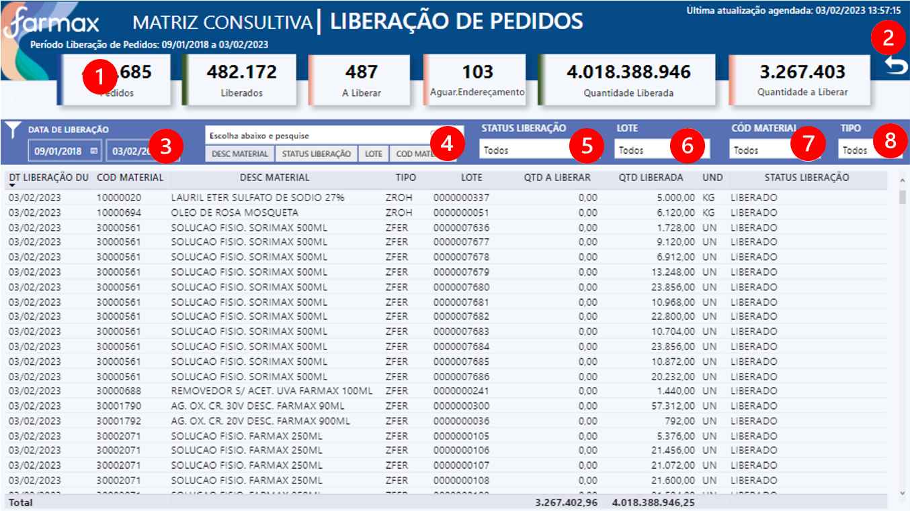

# **Seja bem vindo (a)**

**Documentação dos dashboards do setor de Qualidade, clique abaixo e navegue para o App no Power BI Service:**

<a href="https://app.powerbi.com/Redirect?action=OpenApp&appId=e88e92bc-c6dd-4cd4-b79e-2eb32b033931&ctid=4019cfa9-aae5-4964-912e-b0e0bb606d37" target="_blank">
**Aplicativo Qualidade**
</a>

---

## **OBJETIVO - LIBERAÇÃO DE PEDIDOS**
Relatório utilizado para retirada da lista de produtos em falta, para auxílio na liberação dos produtos.

## **FONTE DE DADOS**

~~~
let
   Fonte = AmazonRedshift.Database("farmax-cluster.cdkgzqhbae0k.us-east-1.redshift.amazonaws.com","farmaxcluster"),
   qlt = Fonte{[Name="qlt"]}[Data],
   dim_order_release1 = qlt{[Name="dim_order_release"]}[Data]
~~~

---
## **TABELAS**

1. Liberação de Pedidos

2. Medidas

6. Última Atualização	

---
## **ATUALIZAÇÃO CONJUNTO DE DADOS**
Atualização diária do conjunto de dados, às 06:30 / 08:30 / 10:30 / 12:30 / 14:30 / 16:30 / 18:30.

---
## **ACESSO**
Acesso via aplicativo Power BI, da seguinte forma:

<a href="https://app.powerbi.com/home" target="_blank">

1. Acessar **powerbi.com.br** </a>

2. Ir no painel de Navegação, opção "Aplicativos" ou "Aplicações"

3. Clicar no Aplicativo - Imagem abaixo>

---
## **USABILIDADE**

### *MATRIZ CONSULTIVA - DISTRIBUIÇÕES**

**Glossário:**

1. Cards resumo numérico
2. Botão para limpar filtros
3. Filtro por **Data do Liberação**
4. Filtro de Texto por **Descrição Material ;Status de Liberação; Lote; Cod Material***
5. Filtro por **Status de Liberação**
6. Filtro por **Lote**
7. Filtro por **Código do Material**
8. Filtro por **Tipo**
---

## **DOCUMENTAÇÃO POWER BI**  - (clique abaixo para visualizar) 

[**Documentação**](AD_Qualidade//DOC_PBI_LIBERACAO_PEDIDOS.htm)

## **CANVAS**  - (clique abaixo para visualizar) 

[**Canvas**](AD_Qualidade/CANVAS_QUALIDADE.pdf)

---

## **MANUAL DO USUÁRIO**  - (clique abaixo para visualizar) 

[**Manual do Usuário**](AD_Qualidade/MANUAL_USUARIO.pdf)

