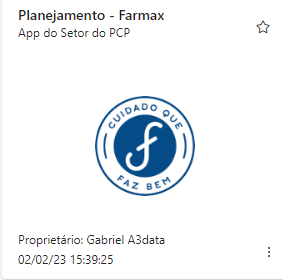
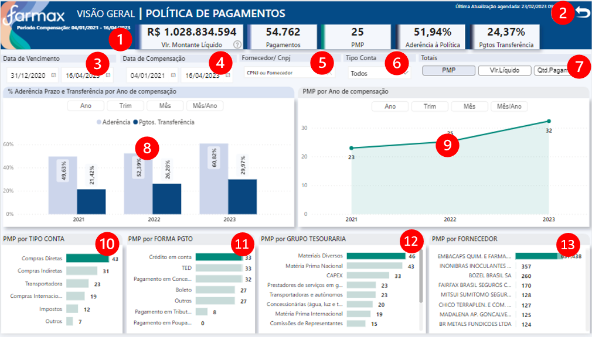
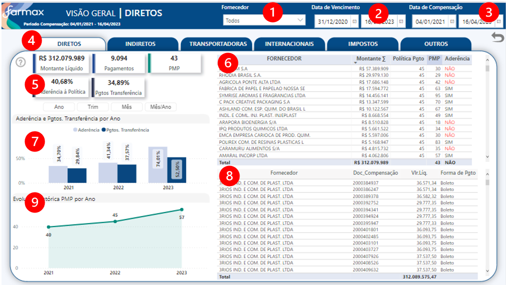
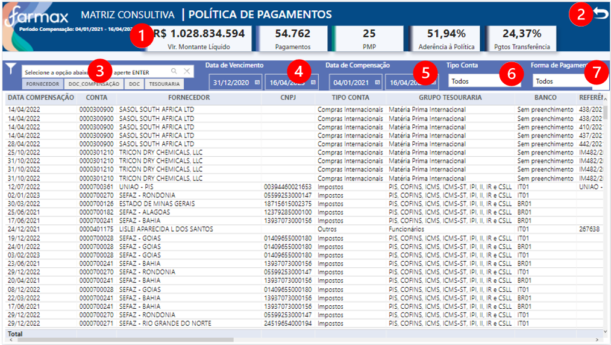

# **Seja bem vindo (a)**

**Documentação dos dashboards do setor de Planehamento, clique abaixo e navegue para o App no Power BI Service:**

<a href="https://app.powerbi.com/Redirect?action=OpenApp&appId=61116a2c-d69d-4d6e-b1ef-70adb59291eb&ctid=4019cfa9-aae5-4964-912e-b0e0bb606d37" target="_blank">
**Aplicativo Planejamento**
</a>

---

## **OBJETIVO - PLANEJAMENTO DE PRODUÇÃO**
Acompanhar política de pagamento dos pedidos, prazo de pagamento, método de pagamento, e tipo de fornecedor.

---

## **FONTE DE DADOS**

~~~
let
    Fonte = AmazonRedshift.Database("farmax-cluster.cdkgzqhbae0k.us-east-1.redshift.amazonaws.com","farmaxcluster"),
    fin = Fonte{[Name="fin"]}[Data],
    dim_prazo_pagamento1 = fin{[Name="dim_prazo_pagamento"]}[Data]
~~~

---
## **TABELAS**

1. PMP

2. Medidas 

3. Parâmetro - Totais	 

4. Parâmetro - Datas	

5. dCalendário	

6. Última Atualização	
	

---
## **ATUALIZAÇÃO CONJUNTO DE DADOS**
Atualização diária do conjunto de dados, às 06:30 / 08:30 / 10:30 / 12:30 / 14:30 / 16:30 / 18:30.

---
## **ACESSO**
Acesso via aplicativo Power BI, da seguinte forma:

<a href="https://app.powerbi.com/home" target="_blank">

1. Acessar **powerbi.com.br** </a>

2. Ir no painel de Navegação, opção "Aplicativos" ou "Aplicações"

3. Clicar no Aplicativo - Imagem abaixo>

---

### **VISÃO GERAL**

**Glossário:**

1. Cards resumo numérico
2. Botão para limpar filtros
3. Filtro: **Data de Vencimento**
4. Filtro: **Data de Compensação**
5. Filtro de Texto: **Busque pelo Nome do Fornecedor ou pelo CNPJ**
6. Filtro: **Tipo de Conta**
7. Filtro: **Totais** -  Total: PMP / Faltas / Valor Líquido / Quantidade de Pagamentos.- *Utilize para filtrar visuais ***9 a 13** 
8. Visual: **Percentual de Aderência ao Prazo de Pagamento e Transferência por Período de Compensação**
9. Visual: **Eixo Dinâmico: Totais por Período de Compensação**
10. Visual: **Eixo Dinâmico: Totais por Tipo de Conta**
11. Visual: **Eixo Dinâmico: Totais por Forma de Pagamento**
12. Visual: **Eixo Dinâmico: Grupo de Tesouraria**
13. Visual: **Eixo Dinâmico: Totais por Fornecedor**

---

### **TIPOS DE CONTA**

**Glossário:**

1. Filtro de Texto: **Busque pelo Nome do Fornecedor ou pelo CNPJ**
2. Filtro: **Data de Vencimento**
3. Filtro: **Data de Compensação**
4. Navegação por página: **Tipo de Conta**
5. Resumo Numérico
6. Matriz de Sumarização de Pagametos por Fornecedor
7. Visual: **Percentual de Aderência ao Prazo de Pagamento e Transferência por Período de Compensação**
8. Matriz de Pagamentos por Fornecedor
9. Visual: **Evolução Histórica PMP por Ano**
---

### **MATRIZ CONSULTIVA**

**Glossário:**

1. Cards resumo numérico
2. Botão para limpar filtros
3. Filtro de Texto por **Fornecedor, Documento de Compensação, Documento, Grupo de Tesouraria**
4. Filtro: **Data de Vencimento**
5. Filtro: **Data de Compensação**
6. Filtro: **Tipo de Conta**
7. Filtro: **Forma de Pagamento**
---

## **DOCUMENTAÇÃO POWER BI**  - (clique abaixo para visualizar) 

[**Documentação**](AD_Planejamento/DOC_PBI_PLANEJAMENTO_PROD.htm)

