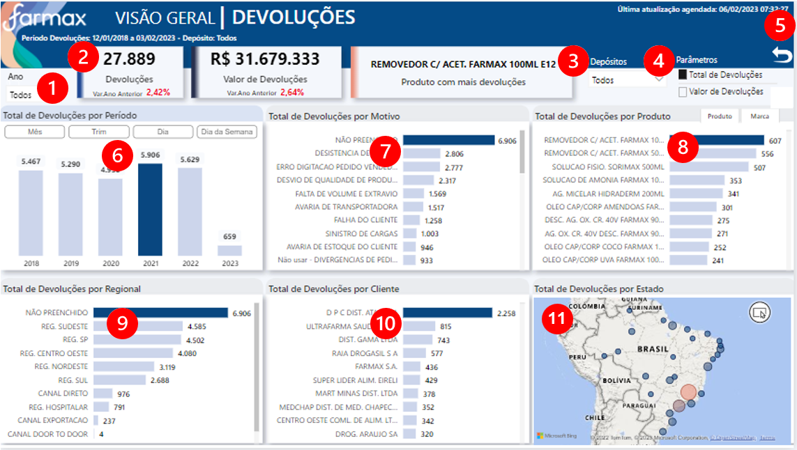
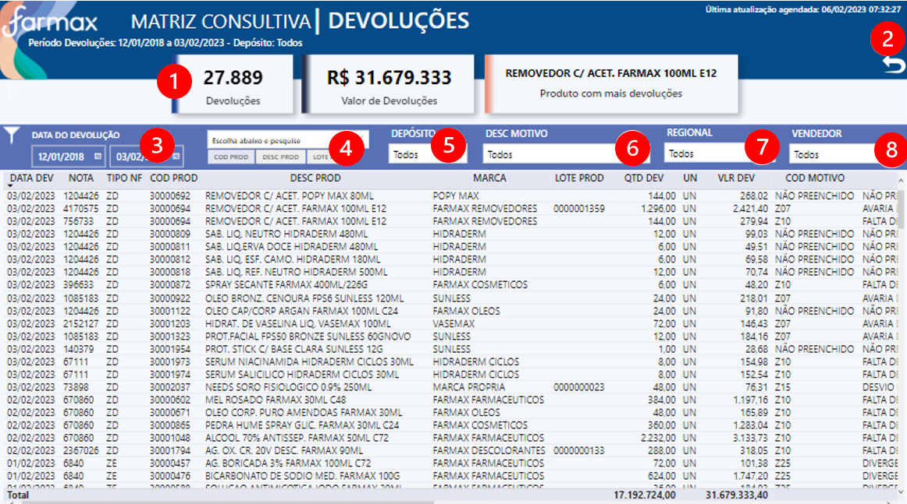

# **Seja bem vindo (a)**

**Documentação dos dashboards do setor de Qualidade, clique abaixo e navegue para o App no Power BI Service:**

<a href="https://app.powerbi.com/Redirect?action=OpenApp&appId=e88e92bc-c6dd-4cd4-b79e-2eb32b033931&ctid=4019cfa9-aae5-4964-912e-b0e0bb606d37" target="_blank">
**Aplicativo Qualidade**
</a>

---

## **OBJETIVO - DEVOLUÇÕES**
É utilizado para compilação dos resultados e indicadores de Qualidade e fonte de informação para a Elaboração dos Relatórios de Revisão de Qualidade dos Produtos (RQP).

---

## **FONTE DE DADOS**

~~~
let
    Fonte = AmazonRedshift.Database("farmax-cluster.cdkgzqhbae0k.us-east-1.redshift.amazonaws.com","farmaxcluster"),
    qlt = Fonte{[Name="qlt"]}[Data],
    dim_devolution1 = qlt{[Name="dim_devolution"]}[Data]
~~~

---
## **TABELAS**

1. Devolução

2. Medidas

3. dCalendario	 

4. Parâmetro Produto/Marca

5. Parâmetro - Reg / Vendededor		

6. Última Atualização	
	

---
## **ATUALIZAÇÃO CONJUNTO DE DADOS**
Atualização diária do conjunto de dados, às 06:30 / 08:30 / 10:30 / 12:30 / 14:30 / 16:30 / 18:30.

---
## **ACESSO**
Acesso via aplicativo Power BI, da seguinte forma:

<a href="https://app.powerbi.com/home" target="_blank">

1. Acessar **powerbi.com.br** </a>

2. Ir no painel de Navegação, opção "Aplicativos" ou "Aplicações"

3. Clicar no Aplicativo - Imagem abaixo>

---

## **USABILIDADE**

### **VISÃO GERAL - DEVOLUÇÕES**

**Glossário:**

1. Filtro: **por Ano de devolução**
2. Cards resumo numérico
3. Filtro: **por Depósito**
4. Filtro: **Parâmetro Totais** -  Selecione ver por Quantidade ou Valor de Devolução. 
5. Botão para limpar filtros
6. Visual:**Total de Devoluções por Período**   - Ano / Trimestre / Mês / Dia / Dia da Semana  
7. Visual: **Total de Devoluções por Motivo**
8. Visual: **Total de Devoluções por Produto**
9. Visual: **Total de Devoluções por Regional**
10. Visual: **Total de Devoluções por Cliente**
11. Visual: **Total de Devoluções por Estado**
---

### **MATRIZ CONSULTIVA - RASTREABILIDADE**

**Glossário:**

1. Cards resumo numérico
2. Botão para limpar filtros
3. Filtro por **Data de Devoluções**
4. Filtro de Texto por **Descrição, Código ou Lote do Produto**
5. Filtro por **Depósito**
6. Filtro por **Descrição do Motivo**
7. Filtro por **Regional**
8. Filtro Cliente por **Vendedor**
---

## **DOCUMENTAÇÃO POWER BI**  - (clique abaixo para visualizar) 

[**Documentação**](AD_Qualidade/DOC_PBI_DEVOLUCOES.htm)

## **CANVAS**  - (clique abaixo para visualizar) 

[**Canvas**](AD_Qualidade/CANVAS_QUALIDADE.pdf)

---

## **MANUAL DO USUÁRIO**  - (clique abaixo para visualizar) 

[**Manual do Usuário**](AD_Qualidade/MANUAL_USUARIO.pdf)

